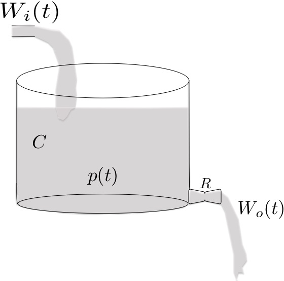

# Classic Control Theory 101 - Laboratory session #1
## Analysis of a first order system 
### Introduction
The aim of this session is a first contact of the students with **Scilab**, as well as the development of a simple function to evaluate first order model for a mechanical and hydraulically systems. The report and code generated (_code from technical report and Scilab code)_ must be submitted by the **classroom git-hub** platform and must include the next sections:

- Introduction
- Methodology (what you did and use)
- Results and Discussion (what you found and saw)
- Conclusions
- References

Specifically the technical report can be done using **Markdown**, **LaTeX** or **R-Studio** syntax. 

**Students must consider that if any kind of plagiarism would cause a zero as the grade of the technical report**

**Note:** Any doubts about this directions please do not hessite in contact me by email. 

### Directions
Most of the laboratory sessions will be divided in several parts, due to its complexity or information required to accomplish the technical report. 

 The part II will be the statement of a more complex system, however in second part students will develop completely the methodology, also students should develop a simple function in **Scilab** to calculate the time response of a first order system by numerator and denominator transfer function's (**TF**) coefficients.

This means for the **TF**:
\\[
TF=\frac{1}{1+2s}
\\] 

**Scilab** should get:
	
	num=[1];
	den=[2 1];
	TF=myFunction(num, den)
	
Thus the **myFunction** response should be a plot with the **TF** response in time domain.

### Submission dead line
The technical report and complete code must be submitted by **Classroom** in the dead line defined during lab sessions. **No extra time would be given to any group**.

# Part 1: First order system
In this first  part of laboratory students must understand the procedure to obtain a generic  transfer function from a first order system.

## Unit Step Response

The response of a system to the unit step input is called the unit step response.  If the problem you are trying to solve has initial conditions you need to include a zero input response in order to obtain the complete response.

Students must take in count the example from inversa Laplace transformations. Considering a system with input $u(t)$  and output $y(t)$, the system will have a transfer function:

\\[
H(s)=\frac{Y(s)}{U(s)}
\\]
thus, there is possible to calculate the output with zero initial conditions by:
\\[
Y(s)=X(s)H(s)
\\]
and considering an unit step input:
\\[
Y(s)=\frac{1}{s}H(s)
\\]

## Step-Response of a first order system
Now consider a first order generic transfer function:

$$H(s)=\frac{bs+c}{s+a} $$

where $a$, $b$ and $c$ are real numbers, then obtain the unit step response of $H(s)$:
$$Y(s)=\frac{1}{s}\frac{bs+c}{s+a}$$

then the previous equation can be rewritten as follow:
$$Y(s)=\frac{A}{s}+\frac{B}{s+a}
now students must obtain a generic unit step response equation an **report it**.

## Example
Try to use the obtained unit step response for the next system and compare the answer with the Scilab's response.

considers that the tank is filled at a flow rate of $W_{i}$ ($m3/sec$), the input to the system.  The output is the discharge flowrate, $W_o$ in ($m3/sec$).  If $W_i= W_o$, the level, $h(t)$, remains constant.  If $W_i > W_o$, the level, $h$, rises.  If $W_i < W$, the level, $h$, falls.[1]

# Part 2

